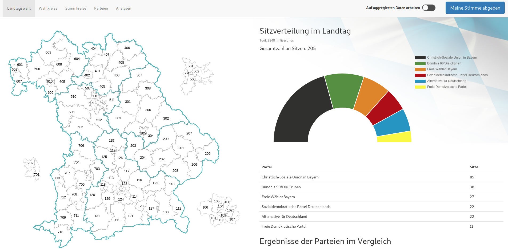

WIS - Wahlinformationssystem für die Landtagswahl Bayern
=====

The project itself is located in `WIS` and can be run with docker. A external SAP HANA database is required.

## Online Version
The project can be found under [https://wis-frontend.herokuapp.com/](https://wis-frontend.herokuapp.com/). Make sure HANA is running if you want to see results... 😅

## Schema
Schema file can be found here:  
[https://www.lucidchart.com/documents/edit/54fe03c9-8ac5-4ea3-b5d5-504a7bc5a5c2/0](https://www.lucidchart.com/documents/edit/54fe03c9-8ac5-4ea3-b5d5-504a7bc5a5c2/0)

## Documents/Artifacts for this project:
 - [DB-Schema](https://github.com/Jibbow/DB-Wahlinformationssystem/blob/master/WIS/DB-Schema.pdf)
 - [Vor- und Nachteile eines DBMS für Wahlsysteme](https://github.com/Jibbow/DB-Wahlinformationssystem/blob/master/Session1/Vorteile-Nachteile.md)
 - [Lastenheft](https://github.com/Jibbow/DB-Wahlinformationssystem/blob/master/Session2/Lastenheft_WIS.pdf)
 - [Pflichtenheft](https://github.com/Jibbow/DB-Wahlinformationssystem/blob/master/Session3/Pflichtenheft_WIS.pdf)
 - [Erste UI-Entwürfe](https://github.com/Jibbow/DB-Wahlinformationssystem/blob/master/Session3/ui_main.PNG)
 - [Data-Scraping](https://github.com/Jibbow/DB-Wahlinformationssystem/tree/master/Session4)
 - [SQL-Queries](https://github.com/Jibbow/DB-Wahlinformationssystem/tree/master/WIS/backend/queries)
 - [Benchmarking](https://github.com/Jibbow/DB-Wahlinformationssystem/tree/master/Benchmarking)
